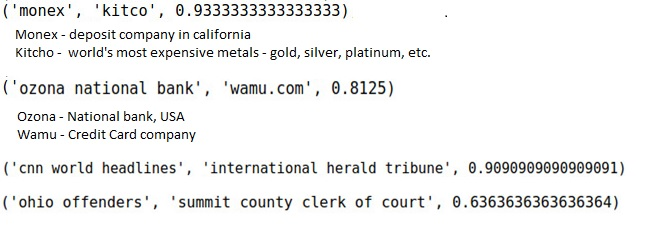

# Big Data Aמalytics - Associative-Rule

Implementation of a rule based machine learning algorithm, a weakened version of Associative rule learning algorithm.
(similar to google feature of related searches)

For each relevant query Sx, Sy, the algorithm calculates {Sx} => {Sy} with confidence Cxy.

DataSet: Over 3.5 million searches from a Brazilian search engine.

# Example results

